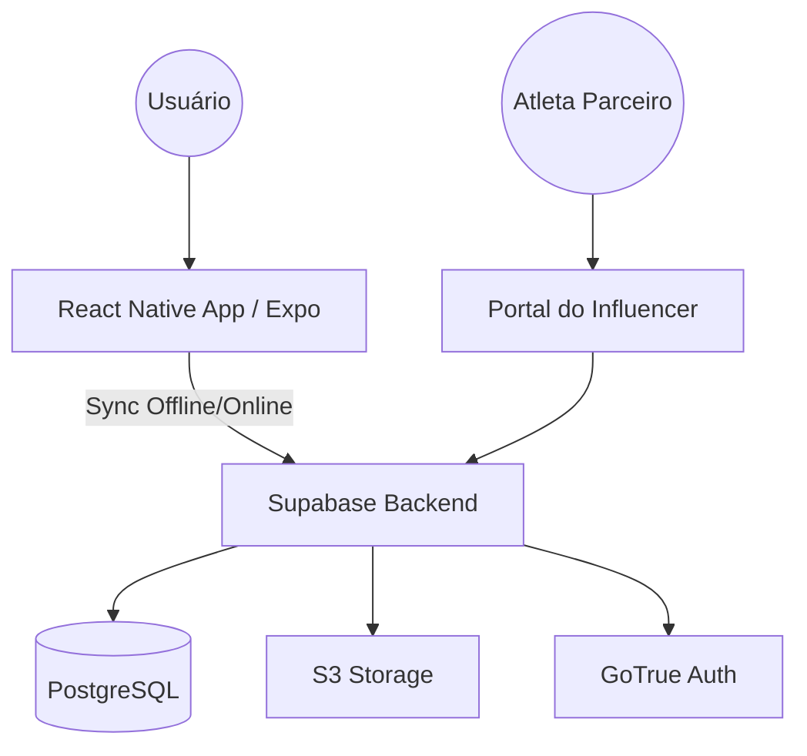

# ProTrack & Flow

> App mobile de fitness que une curadoria de atletas profissionais
> com ferramentas de registro de performance.

## O que é
O ProTrack & Flow é uma plataforma completa de treinamento que preenche a lacuna entre atletas de elite e entusiastas do fitness. Através de uma curadoria rigorosa de atletas profissionais, o aplicativo oferece planos de treino autênticos e testados, combinados com ferramentas avançadas de registro de performance para garantir que cada série conte.

Nossa missão é democratizar o acesso a metodologias de treino profissionais, permitindo que qualquer usuário treine com a mesma estrutura e foco de um atleta de alto rendimento, mantendo um registro preciso de sua evolução ao longo do tempo.

## Status do projeto
| Fase | Status | Previsão |
|------|--------|----------|
| Fase 0 — Discovery | ✅ Completo | Sem 1-2 |
| Fase 1 — Design & Arquitetura | ✅ Completo | Sem 3-5 |
| Fase 2 — MVP | 🔄 Em andamento | Sem 6-12 |

## Arquitetura em 30 segundos

## Como rodar localmente
[Link para /docs/setup-guide.md](./docs/setup-guide.md)

## Documentação completa
- [API Reference](./docs/api.md)
- [Architecture Decisions](./docs/architecture.md)
- [Design System](./docs/design-system.md)
- [Data Model](./docs/data-model.md)
- [Content Library](./docs/content-library.md)
- [Offline Sync Strategy](./docs/offline-sync.md)
- [Agent Handoff Log](./docs/agent-handoff.md)

## Time de agentes
| Agente | Responsabilidade | Workspace |
|--------|-----------------|-----------|
| Mobile Engineer | App iOS/Android | protrack-mobile |
| Backend Engineer | Supabase, APIs | protrack-backend |
| QA Engineer | Testes e qualidade | protrack-tests |
| Technical Writer | Documentação | protrack-docs |
