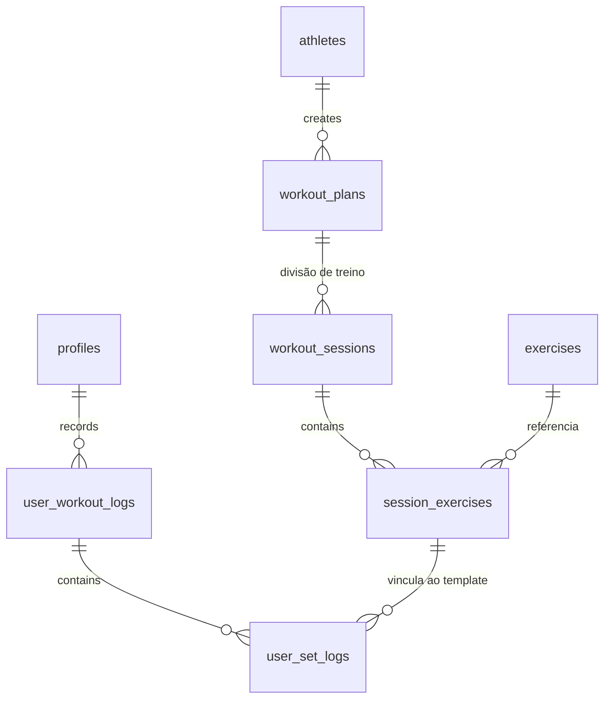

# Modelo de Dados (Schema)

Este documento descreve o esquema oficial do banco de dados PostgreSQL (Supabase) do projeto ProTrack & Flow.

> [!IMPORTANT]
> Sincronizado com a migration oficial: `20260509192527_initial_schema.sql`.

## Diagrama ER (Mermaid)

## Tabelas e Campos (Dicionário)

### 1. Núcleo de Usuários e Atletas
- **`profiles`**: Dados estendidos do usuário vinculados ao `auth.users`.
  - `id` (uuid, PK): Referência ao auth do Supabase.
  - `username` (text, unique): Nome de usuário único.
  - `full_name` (text): Nome completo.
  - `level` (enum): beginner, intermediate, advanced.
  - `avatar_url` (text): URL da foto de perfil.

- **`athletes`**: Perfil dos influenciadores/parceiros que criam planos.
  - `id` (uuid, PK): Identificador único.
  - `name` (text): Nome artístico/profissional.
  - `instagram` (text): Link/handle do Instagram.
  - `is_verified` (bool): Selo de verificação.

### 2. Planos e Estrutura de Treino
- **`workout_plans`**: Planos de treino (ex: "Projeto Verão 90 dias").
  - `id` (uuid, PK): Identificador único.
  - `athlete_id` (uuid, FK): Criador do plano.
  - `level` (enum): beginner, intermediate, advanced.
  - `duration_weeks` (int): Duração total estimada.
  - `is_published` (bool): Flag de visibilidade.

- **`workout_sessions`**: Sessões ou "dias" dentro de um plano.
  - `id` (uuid, PK).
  - `plan_id` (uuid, FK).
  - `day_number` (int): Ordem no plano.
  - `title` (text): Ex: "Push Day", "Treino A".
  - `estimated_minutes` (int): Tempo sugerido.

- **`session_exercises`**: Exercícios específicos de uma sessão.
  - `id` (uuid, PK).
  - `session_id` (uuid, FK).
  - `exercise_id` (uuid, FK).
  - `order_index` (int): Sequência de execução.
  - `sets` (int): Quantidade de séries sugeridas.
  - `reps_target` (text): Ex: "8-12", "Falha".
  - `rest_seconds` (int): Tempo de descanso padrão.

### 3. Biblioteca e Performance
- **`exercises`**: Catálogo global de exercícios.
  - `id` (uuid, PK).
  - `name` (text): Nome do exercício.
  - `muscle_group` (text): Peito, Costas, etc.
  - `youtube_video_id` (text): ID do vídeo para embed.
  - `equipment` (text[]): Lista de equipamentos necessários.

- **`user_workout_logs`**: Sessão de treino realizada pelo usuário.
  - `id` (uuid, PK): Identificador único gerado pelo banco de dados.
  - `client_id` (uuid, unique): Unique Identifier para deduplicação offline (gerado pelo App).
  - `user_id` (uuid, FK).
  - `session_id` (uuid, FK): Referência ao template (opcional).
  - `started_at` (timestamptz).
  - `completed_at` (timestamptz).
  - `synced_at` (timestamptz): Timestamp do servidor no momento do sync.

- **`user_set_logs`**: Detalhamento de cada série executada.
  - `id` (uuid, PK): Identificador único gerado pelo banco de dados.
  - `client_id` (uuid, unique): Unique Identifier para deduplicação offline (gerado pelo App).
  - `log_id` (uuid, FK): Vínculo com a sessão de log.
  - `session_exercise_id` (uuid, FK).
  - `weight_kg` (numeric): Carga utilizada (ex: 80.50).
  - `reps_done` (int): Repetições concluídas.

## Segurança e Performance
- **RLS**: Todas as tabelas possuem Row Level Security habilitado. Usuários só podem visualizar planos publicados e seus próprios logs.
- **Indexes**: Índices criados em `is_published`, `muscle_group` e nas chaves estrangeiras de logs para otimização de busca e analytics.
