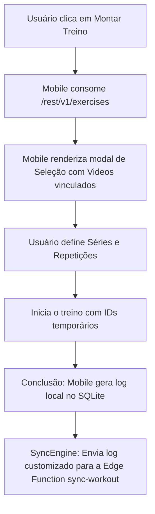

# Documento de Alinhamento Técnico — Funcionalidade de Montagem de Treinos

Este documento detalha a implementação da funcionalidade de **Montagem de Treinos Customizados** (ad-hoc) no aplicativo mobile do ProTrack & Flow, servindo como guia de alinhamento para que a equipe de backend ajuste e valide os schemas, RLS e a Edge Function de sincronização.

---

## 🧭 Fluxo da Funcionalidade no Mobile

---

## 🔌 Consumo de API (Mobile -> Backend)

Para renderizar o catálogo de exercícios disponíveis, o aplicativo consome a tabela `exercises` através do seguinte endpoint REST do Supabase:

*   **Endpoint:** `/rest/v1/exercises?select=*`
*   **Método:** `GET`
*   **Campos Consumidos & Mapeados:**
    *   `id` (uuid): Identificador primário do exercício.
    *   `name` (text): Exibido na lista de seleção e no player.
    *   `muscle_group` (text): Utilizado para filtrar e exibir a etiqueta de agrupamento muscular.
    *   `youtube_video_id` (text): Passado diretamente para o `FloatingYouTubePlayer` para carregar a demonstração da execução.

---

## 💾 Desafios de Sincronização & Alinhamento Necessário no Backend

Como este treino é montado sob demanda (ad-hoc) pelo usuário, ele **não possui vínculo direto com um plano de treino predefinido** de um atleta. Isso traz impactos na estrutura dos logs que serão enviados à Edge Function `/functions/v1/sync-workout`.

Solicitamos os seguintes ajustes e validações no banco e na função de sincronização:

### 1. Nulabilidade do campo `session_id` em `user_workout_logs`
*   **Contexto:** Treinos criados sob demanda não possuem uma referência à tabela `workout_sessions`.
*   **Ação Necessária:** Verificar se a coluna `session_id` na tabela `user_workout_logs` está configurada como **nullable** (`NULL ALLOWED`) no PostgreSQL. Caso contrário, a Edge Function rejeitará o insert por violação de constraint de chave estrangeira.

### 2. Nulabilidade ou Tratamento de `session_exercise_id` em `user_set_logs`
*   **Contexto:** Na estrutura tradicional, cada série (`user_set_logs`) está vinculada ao exercício de um template por meio do `session_exercise_id`. Para treinos customizados, esse vínculo de template não existe.
*   **Ação Necessária:** 
    *   Garantir que a coluna `session_exercise_id` na tabela `user_set_logs` seja opcional (nullable), ou;
    *   Adicionar suporte à persistência opcional do `exercise_id` diretamente no `user_set_logs` (ou garantir que o sync lide com a ausência de `session_exercise_id` registrando as séries sem crashar as constraints de integridade referencial).

### 3. Garantia de Vídeos Válidos
*   **Ação Necessária:** O mobile confia plenamente na presença de `youtube_video_id` válidos vindos do catálogo. Por favor, certifique-se de que a biblioteca oficial inserida nas migrations (como `20260512212600_real_exercise_library.sql`) esteja completamente preenchida e saneada no banco de staging/produção.

---

## 🛠️ Modificações Realizadas no Mobile para Referência

*   **API Service (api.ts):** Adicionado o método `fetchExercises()` e a interface `Exercise`.
*   **Nova Tela (BuildWorkoutScreen.tsx):** Criada a tela com seleção assíncrona, steppers para controle de séries/reps e despacho para a store ativa.
*   **Navegador (RootNavigator.tsx):** Registrada a tela `BuildWorkout` no stack principal como uma apresentação modal nativa.

---

## 🔒 Validações e Adições — Backend Engineer

A análise do fluxo "Montar Treino" revela pontos de arquitetura extremamente pertinentes. Abaixo estão os alinhamentos e as garantias da camada de backend:

### 1. Nulabilidade de `session_id`
*   **Status:** ✅ **Garantido**.
*   **Detalhes:** Na migration inicial `20260509192527_initial_schema.sql` (linha 79), a coluna `session_id` na tabela `user_workout_logs` já foi definida sem a constraint `NOT NULL` e com `ON DELETE SET NULL`. Treinos ad-hoc (com `session_id = null`) serão persistidos normalmente.

### 2. Tratamento de `session_exercise_id` e Preservação do Exercício
*   **Status:** ⚠️ **Refatoração Mapeada**.
*   **Detalhes:** Brilhante observação! A coluna `session_exercise_id` em `user_set_logs` também já é *nullable* por padrão. Contudo, se este campo vier nulo em um treino customizado, o banco de dados perderia completamente o vínculo de *qual* exercício o usuário executou.
*   **Próxima Ação (Backend):** Será criada uma migration para adicionar a coluna `exercise_id UUID REFERENCES exercises(id)` na tabela `user_set_logs`. A Edge Function `sync-workout` será atualizada para aceitar o `exercise_id` no payload e a rota de `user-progress` será ajustada para consultar diretamente esta nova coluna de forma agnóstica a templates.

### 3. Garantia de Vídeos Válidos
*   **Status:** ✅ **Garantido**.
*   **Detalhes:** A biblioteca real incluída na migration `20260512212600_real_exercise_library.sql` contém 10 exercícios base (Peito, Costas, Pernas, Ombros, Bíceps, Tríceps) todos curados com `youtube_video_id` reais e estáticos. Não há risco de quebra no player `FloatingYouTubePlayer`.
